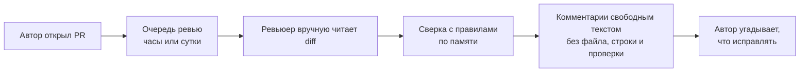
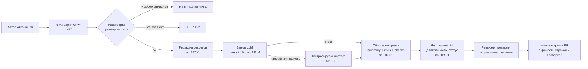

# Анализ процесса: AS IS и TO BE

## AS IS

Текущий процесс ревью PR в команде выполняется полностью вручную.

1. Автор открывает PR и ставит ревьюера в очередь.
2. Ревьюер ждёт свободного окна: PR лежит в очереди часы, иногда сутки.
3. Ревьюер вручную читает diff целиком, держа в голове правила репозитория (`SEC-1`, `API-1`, `REL-1`, `OUT-1`, `SCOPE-1`, `QA-1`, `OBS-1`).
4. Ревьюер пишет комментарии свободным текстом. Часть замечаний — общие («добавьте тесты»), без файла, строки и доказательства.
5. Автор угадывает, что именно исправлять, и какие проверки запускать.

Участники: автор PR, ревьюер, CI.

Где теряется время и информация:

- **Задержка:** ожидание ревьюера — самая длинная фаза, сам разбор diff занимает минуты.
- **Ручная операция:** сверка diff с семью правилами репозитория по памяти.
- **Потеря информации:** правила репозитория живут в head'ах людей, а не во входе процесса; нарушение `SEC-1` или `OUT-1` замечает только тот ревьюер, который помнит правило.
- **Невоспроизводимость:** к комментарию не приложена проверка, которой можно подтвердить или опровергнуть замечание.

## TO BE

Между открытием PR и ревьюером появляется AI-помощник. Он не заменяет человека: он готовит структурированный черновик, в котором каждый риск привязан к строке diff или к правилу репозитория, а решение по-прежнему принимает ревьюер (`SCOPE-1`).

Границы процесса TO BE: помощник только советует. Он не делает approve, не мержит и не меняет код.

## Разница

| Что меняется | AS IS | TO BE | Как проверим изменение |
|---|---|---|---|
| Момент появления первой обратной связи | После того, как освободился ревьюер (часы) | Сразу после открытия PR (секунды) | E2E-сценарий: замер времени от `POST /api/reviews` до ответа, см. [`tests_e2e.md`](tests_e2e.md) |
| Сверка с правилами репозитория | По памяти ревьюера, выборочно | Правила во входе помощника, `QA-1` требует доказательства | Unit-проверки соответствия `QA-1` и `OUT-1`, см. [`tests_unit.md`](tests_unit.md) |
| Форма замечания | Свободный текст, часто без адреса | `summary` + до трёх `risks` с `file`, `line`, `evidence`, `risk` + `checks` (`OUT-1`) | Валидация схемы ответа в integration-проверках |
| Утечка секретов во внешний LLM | Не контролируется | Редакция до отправки (`SEC-1`) | Integration-тест: diff с тестовым токеном → в prompt `[REDACTED]` |
| Поведение при сбое LLM | Не определено | Контролируемый ответ за 10 с (`REL-1`) | Integration-тест с медленным и падающим LLM |
| Огромный diff | Ревьюер тонет в объёме | Отклонён с HTTP 413 (`API-1`) | Граничная проверка на 20 000 / 20 001 символ |
| Кто принимает решение | Ревьюер | Ревьюер (`SCOPE-1` не меняет ответственность) | Проверка отсутствия действий в GitHub у сервиса |

## Как использовали AI

- Для чего: разложить текущий ручной процесс ревью на шаги и собрать TO BE, в котором каждое звено привязано к правилу из [`CASE.md`](CASE.md).
- Тип промпта: master prompt (запуск 2), раздел «Задача и артефакты».
- Строка в [`prompts.md`](prompts.md): P1-02.
- Что проверили и исправили сами: модель предлагала в TO BE авто-approve при отсутствии рисков — отклонили как прямое нарушение `SCOPE-1`. Также добавили ветку 413 (`API-1`), которую модель опустила, и убрали из схемы логирование содержимого diff, противоречащее `OBS-1`.
