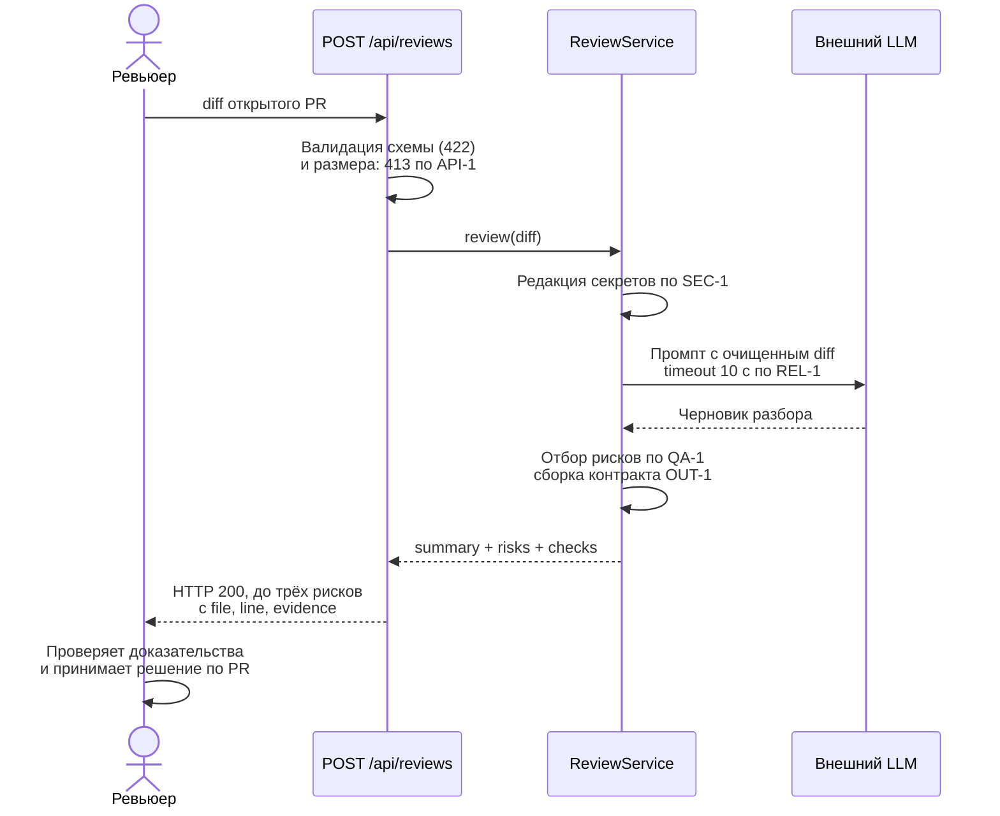

# Use cases и user stories

## Первый рабочий сценарий

**Когда** ревьюер отправляет diff открытого PR в `POST /api/reviews`, **система** очищает diff от секретов, запрашивает у LLM разбор и возвращает структурированный черновик (`summary`, до трёх `risks` с файлом, строкой и доказательством, список `checks`), **а пользователь получает** адресные находки, каждую из которых можно подтвердить строкой diff или правилом репозитория, и сам принимает решение по PR.

Не входит в этот сценарий:

- approve, merge и любые другие действия в GitHub — запрещены `SCOPE-1`;
- генерация или правка кода за автора PR;
- разбор нескольких PR в одном запросе;
- аутентификация и авторизация эндпоинта;
- ревью diff длиннее 20 000 символов — такой запрос отклоняется по `API-1`.

## Use case

| Поле | Значение |
|---|---|
| Актор | Ревьюер PR (человек); технический актор — CI, который может вызвать эндпоинт при открытии PR |
| Триггер | Открыт PR, ревьюер отправляет его diff в `POST /api/reviews` |
| Предусловия | Сервис доступен; тело запроса содержит поле `diff`; длина `diff` ≤ 20 000 символов (`API-1`); внешний LLM настроен |
| Основной результат | HTTP 200 и тело по `OUT-1`: `summary`, `risks` (0–3 элемента с `file`, `line`, `evidence`, `risk`), `checks`. Каждый риск подтверждён строкой diff или правилом репозитория (`QA-1`). В лог записаны только `request_id`, длительность и статус (`OBS-1`) |
| Ошибка или отказ | 422 — в теле нет поля `diff`; 413 — diff длиннее 20 000 символов (`API-1`); при таймауте 10 с или ошибке LLM — контролируемый ответ с пустым `risks` и пояснением в `summary`, без падения с 500 (`REL-1`). Во всех ветках решение по PR остаётся за человеком (`SCOPE-1`) |



## User stories и acceptance criteria

**US-1.** Как ревьюер, я хочу получать риски с указанием файла, строки и доказательства, чтобы не перепроверять весь diff вручную и не спорить с общими формулировками.

**US-2.** Как ответственный за безопасность, я хочу, чтобы секреты не покидали периметр, чтобы использование внешнего LLM не создавало утечку.

**US-3.** Как ревьюер, я хочу предсказуемый ответ при сбое LLM, чтобы недоступность внешней модели не блокировала мою работу.

```gherkin
Feature: Черновик ревью PR от AI-помощника

  Scenario: Позитивный — структурированный разбор валидного diff
    Given сервис доступен и внешний LLM отвечает за 3 секунды
    And тело запроса содержит поле "diff" длиной 1 500 символов
    When ревьюер отправляет POST /api/reviews
    Then код ответа 200
    And тело содержит поля "summary", "risks" и "checks"
    And в "risks" не больше трёх элементов
    And у каждого элемента "risks" заполнены "file", "line", "evidence" и "risk"
    And каждый риск подтверждён строкой diff или правилом репозитория

  Scenario: Негативный — секреты не уходят во внешний LLM
    Given diff содержит строку "api_token = ghp_TESTSECRET0123456789"
    When ревьюер отправляет POST /api/reviews
    Then в промпте, ушедшем во внешний LLM, нет подстроки "ghp_TESTSECRET0123456789"
    And на её месте находится "[REDACTED]"
    And в логах записаны только request_id, длительность и статус

  Scenario: Негативный — сбой внешнего LLM
    Given внешний LLM отвечает ошибкой или не отвечает дольше 10 секунд
    When ревьюер отправляет POST /api/reviews
    Then код ответа не 500
    And тело соответствует контракту OUT-1
    And "risks" пустой
    And "summary" сообщает, что разбор не выполнен из-за недоступности модели

  Scenario: Граничный — diff на пределе размера
    Given длина поля "diff" равна 20 000 символов
    When ревьюер отправляет POST /api/reviews
    Then код ответа 200
    But если длина равна 20 001 символу
    Then код ответа 413

  Scenario: Граничный — нет поля diff
    Given тело запроса не содержит поле "diff"
    When ревьюер отправляет POST /api/reviews
    Then код ответа 422
    And ответ не содержит трассировку исключения
```

## Как использовали AI

- Для чего: развернуть первый рабочий сценарий в use case и Gherkin-сценарии с acceptance criteria.
- Тип промпта: master prompt (запуск 2), раздел «Формат результата».
- Строка в [`prompts.md`](prompts.md): P1-02.
- Что проверили и исправили сами: модель написала сценарий «AI одобряет PR, если рисков нет» — удалили как нарушение `SCOPE-1`. В позитивном сценарии добавили проверку «не больше трёх элементов» и обязательные поля, которых не было в черновике: без них `OUT-1` не проверяется. Граничный сценарий с 20 000 / 20 001 символом составили сами по `API-1` — модель ограничилась общей фразой «слишком большой diff отклоняется».
