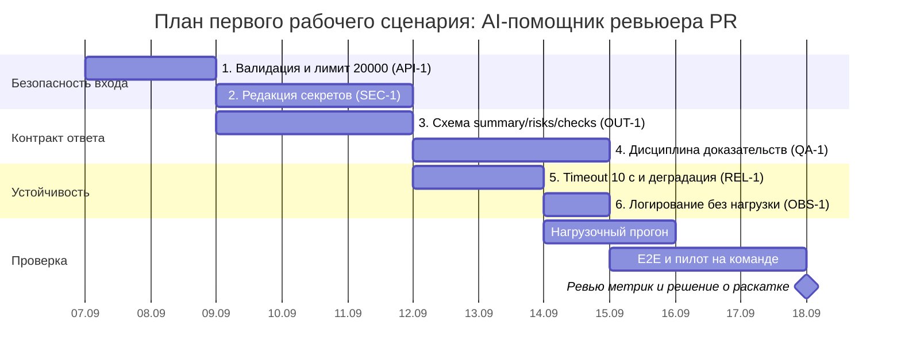

# План поставки

Поставка разбита так, чтобы каждый инкремент закрывал конкретное правило репозитория и давал наблюдаемый результат. Порядок продиктован риском: сначала то, что делает помощника безопасным (`SEC-1`, `API-1`), затем контракт (`OUT-1`, `QA-1`), затем устойчивость и наблюдаемость (`REL-1`, `OBS-1`).

## Инкременты и ответственность

| Инкремент | Наблюдаемый результат | Что делает человек | Что делает AI или субагент | Проверка | Зависимости |
|---|---|---|---|---|---|
| 1. Валидация входа и лимит размера | `POST /api/reviews` принимает Pydantic-модель: 422 при отсутствии `diff`, 413 при длине > 20 000 символов (`API-1`) | Утверждает схему запроса и код ответа; ревьюит PR | Генерирует Pydantic-модель, обработчик и параметризованные тесты границы 20 000 / 20 001 | Integration-тесты 422 и 413, см. [`tests_integration.md`](tests_integration.md) | Нет |
| 2. Редакция секретов | В промпт, уходящий во внешний LLM, попадает `[REDACTED]` вместо токенов, паролей и приватных ключей (`SEC-1`) | Утверждает список паттернов секретов и порог полноты; проверяет на реальных diff | Пишет функцию редакции и unit-тесты по каждому паттерну | Unit-проверки редакции + integration-тест с тестовым токеном, см. [`tests_unit.md`](tests_unit.md) | 1 |
| 3. Контракт ответа `OUT-1` | Ответ содержит `summary`, `risks` (≤ 3, с `file`, `line`, `evidence`, `risk`) и `checks` вместо `{"comment": str}` | Определяет правила отбора трёх рисков при переполнении; принимает контракт | Реализует парсинг ответа модели в схему, отбрасывает риски без обязательных полей | Валидация схемы в integration-тестах; проверка усечения до трёх рисков | 1 |
| 4. Дисциплина доказательств `QA-1` | Риск без ссылки на строку diff или правило репозитория не попадает в ответ | Размечает эталонный набор из 20 diff; выносит решение по спорным рискам | Формирует промпт, требующий evidence; фильтрует неподтверждённые риски | Прогон эталонного набора: доля неподтверждённых ≤ 10%, см. [`problem.md`](problem.md) | 3 |
| 5. Timeout и контролируемая ошибка | При сбое или таймауте 10 с сервис возвращает валидный по `OUT-1` ответ с пустым `risks`, а не 500 (`REL-1`) | Утверждает бюджет 10 с и текст `summary` для деградации | Реализует timeout, `try/except` и маппинг ошибок; пишет тесты с падающим и медленным стабом | Integration-тесты сбоя и таймаута; нагрузочный прогон, см. [`tests_load.md`](tests_load.md) | 3 |
| 6. Логирование `OBS-1` | В логе только `request_id`, длительность и статус; ни содержимого diff, ни ответа модели | Проверяет логи на отсутствие полезной нагрузки перед релизом | Добавляет middleware логирования и тест на отсутствие diff в логах | Unit-проверка состава лог-записи; ручная проверка на релизе | 5 |
| 7. E2E и пилот на команде | Ревьюер получает черновик за ≤ 1 мин после открытия PR и подтверждает пользу | Проводит пилот, собирает замечания ревьюеров, решает о раскатке | Прогоняет E2E-сценарии, готовит сводку по метрикам | E2E-сценарии, см. [`tests_e2e.md`](tests_e2e.md); метрики из [`problem.md`](problem.md) | 1–6 |

Граница ответственности одна во всех инкрементах: AI готовит код, тесты и черновики находок, человек утверждает контракт, размечает эталон и принимает решение по PR. `SCOPE-1` не позволяет сервису делать approve или merge ни на одном этапе.

## Диаграмма Ганта

Критический путь: инкремент 1 → 3 → 4 → E2E. Инкремент 2 (`SEC-1`) идёт параллельно контракту, но релиз без него невозможен: пока редакции нет, каждый запрос отправляет секреты наружу.

## Как использовали AI

- Для чего: разложить решение на инкременты с наблюдаемым результатом и распределить работу между человеком и AI.
- Тип промпта: master prompt (запуск 2), раздел «Рабочий процесс и остановка».
- Строка в [`prompts.md`](prompts.md): P1-02.
- Что проверили и исправили сами: модель поставила редакцию секретов пятым инкрементом, после контракта ответа — переставили на второй: до неё каждый прогон утекает секреты, поэтому инкременты 3–4 нельзя тестировать на реальных diff. Также убрали предложенный инкремент «автопостинг комментариев в GitHub» (нарушает `SCOPE-1`) и добавили инкремент 6 по `OBS-1`, который модель пропустила целиком. Зависимости между инкрементами проставили вручную и сверили с диаграммой Ганта.
