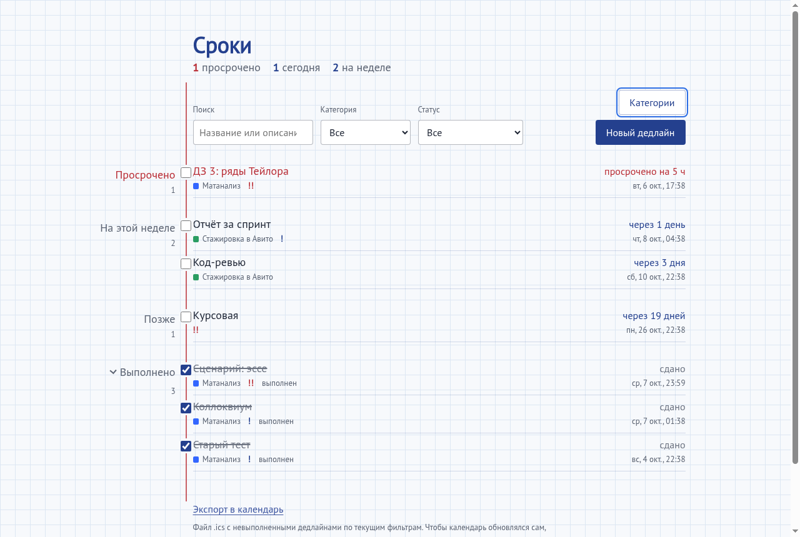
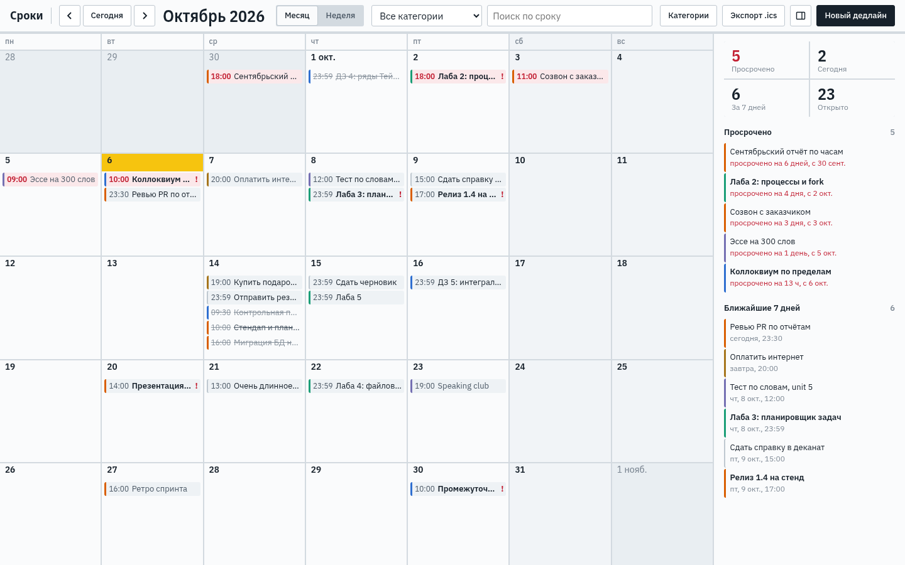
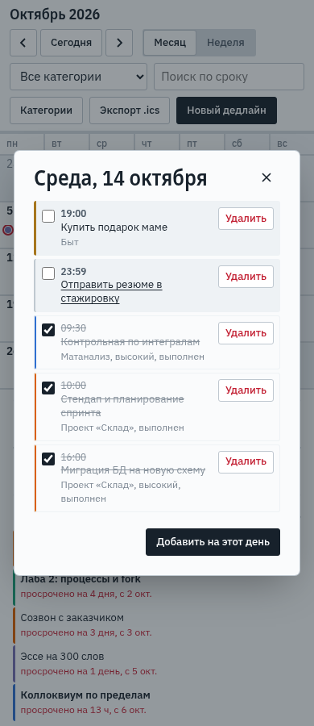
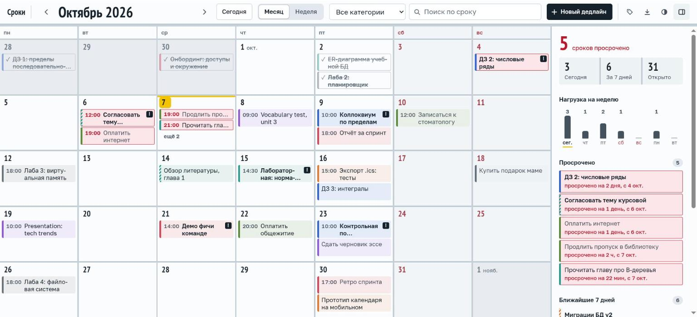
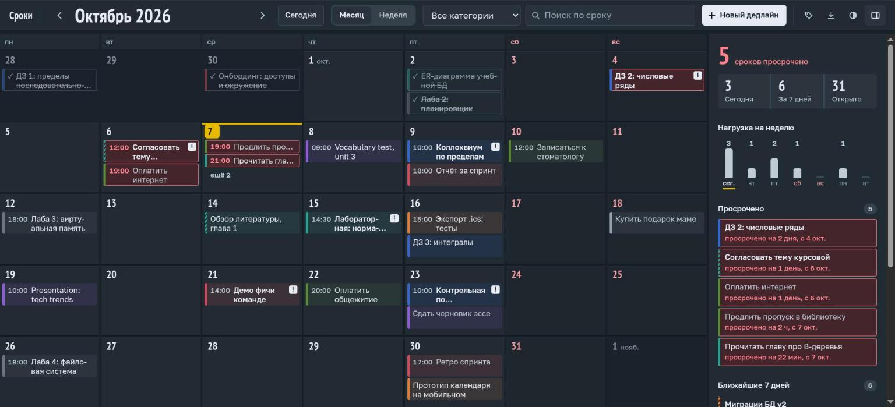
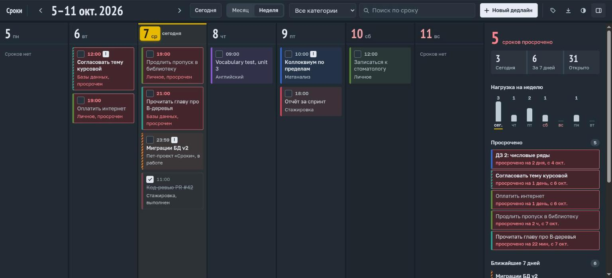
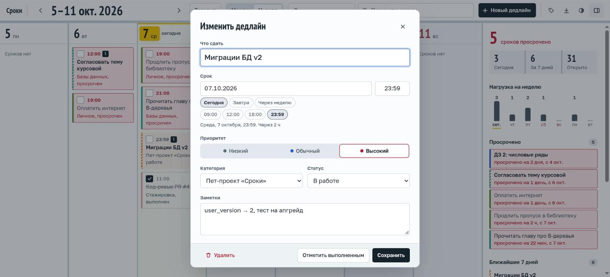
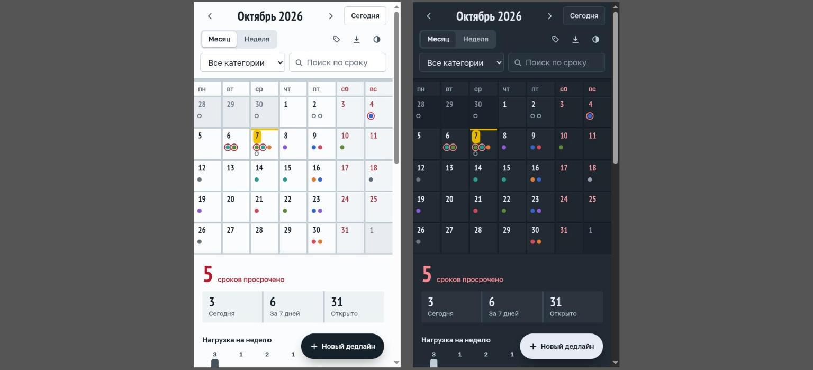

# REPORT: практика 4, среда агента, skill и собственный MCP

Задача: self-hosted трекер дедлайнов «Сроки» (`project/`). Бэкенд на Python stdlib + SQLite,
фронтенд на Svelte 5 + Vite + TypeScript. Агент: **Claude Code** (Opus 5.5) вместо OpenCode.
Работа шла в режиме «оркестратор + два субагента». Фича A (бэкенд) делалась в основной копии,
фича B (фронтенд) параллельно в `git worktree`, после чего результаты объединялись.

<video src="media/orchestration.mp4" controls width="100%"></video>

[`media/orchestration.mp4`](media/orchestration.mp4), 30 с: оркестратор и два фоновых
субагента. Слева план и раздача итераций, справа бэкенд-агент пишет `db.py`/`server.py`,
а фронтенд-агент пишет `frontend/` в worktree.

## 1. Среда агента

| Компонент | Файлы | Зачем |
|---|---|---|
| Runner | Claude Code CLI. Проверки: `pyright` (через хук), `python3 -m unittest discover tests`, во фронтенде `npm run check` / `npm test` (vitest) / `npm run build` | Агент сам запускает проверки и получает их результат. Допуск к командам задан в `project/.claude/settings.json` (`permissions.allow`). |
| Правила (аналог `AGENTS.md`) | `project/.claude/rules/{project,python-backend,sqlite,frontend}.md` | Claude Code вместо `AGENTS.md` читает `CLAUDE.md` и `.claude/rules/`. Правило с `paths:` подгружается только при работе с подходящими файлами, поэтому фронтенд-агент не тащит в контекст правила SQLite. |
| Skills | `project/.claude/skills/python-best-practices/`, `frontend-design/`, `deadlines/` (свой, со скриптом) | Идиомы типизации под pyright. Дизайн-процесс без шаблонных решений. Работа с данными трекера из чата (см. раздел 2). |
| MCP | `project/.mcp.json`: `sqlite` (свой, `.claude/mcp/sqlite_mcp.py`), `grepai` | Схема и данные БД без ручного `sqlite3`. Семантический поиск по коду («где делается X»). |
| MCP (браузер) | расширение Claude in Chrome | Визуальная проверка фронтенда в настоящем браузере: скриншоты, консоль, сеть, прогон сценариев. |
| Хуки | `project/.claude/settings.json` → `.claude/hooks/require_python_skill.py` (PreToolUse), `lsp_diagnostics.py` (PostToolUse), `grepai watch` (SessionStart) | Нельзя править `.py` без скила. После каждой правки агент получает ошибки pyright. Индекс grepai остаётся свежим. |
| Субагенты (бонус) | `project/.claude/agents/{backend,frontend}-dev.md` (`model: opus`, `effort: medium`) | Зоны ответственности и уровень рассуждений для агентов. |
| Контракт | `project/docs/PLAN.md` | Общий API-контракт для двух параллельных агентов. Менял его только оркестратор: v1 → v1.3, затем UX v2 и план v3 (Svelte). |

### Как это применялось
- **Правила.** Их выполнение видно в коде:
  - все SQL-запросы параметризованы, порядок сортировки выбирается из белого списка (`sqlite.md`);
  - схема создаётся миграциями через `PRAGMA user_version`;
  - тесты работают на временной БД, чужая таблица `notes` в `data/app.db` уцелела;
  - во фронтенде `{@html}` встречается 0 раз, внешних URL нет (`frontend.md`).

  Когда фронтенд переводили на Svelte, правила обновил оркестратор (`frontend.md`, `project.md`,
  блок ограничений в `frontend-design`). Белый список npm-зависимостей зафиксирован в правиле,
  а агенты обосновывали в отчёте каждое отступление от него (TypeScript ~6, `@fontsource/*`).
- **Хук PreToolUse сработал на самом оркестраторе.** Попытка править `lsp_diagnostics.py` без
  скила была заблокирована:
  `PreToolUse:Edit hook error: Перед правкой Python-файлов загрузи скил python-best-practices…`.
  После вызова `Skill(python-best-practices)` правка прошла. Та же блокировка срабатывала и на
  скрипт заполнения БД демо-данными в scratchpad.
- **Хук PostToolUse нашёл проблему в самом себе.** Бэкенд-агент сообщил, что на каждую правку
  тестов хук выдаёт `Import "backend" could not be resolved`, хотя `pyright` из CLI чист. Агент
  нашёл причину, проверив копию хука: в `initialize` не передаётся `workspaceFolders`. С моего
  согласия добавлена одна строка, плюс `pyrightconfig.json`. Проверка на `tests/test_server.py`:
  старая версия хука возвращает ошибку, новая — пустой вывод.
- **grepai в worktree** пришлось инициализировать отдельно: скопирован `.grepai/config.yaml`,
  запущен `grepai watch --background`. MCP-сервер сессии смотрит в основную копию, поэтому
  фронтенд-агенту дана инструкция искать через CLI `grepai search` из своей папки.
- **Claude in Chrome.** Фронтенд-агент v3 проверял каждую итерацию в Chrome на собранном
  `dist/` и реальном бэкенде с тестовыми данными (7 категорий, 36 дедлайнов). Так нашлись баги,
  которые не видны в тестах:
  - `<dialog>` после закрытия крестиком больше не открывался;
  - сводка сжималась до нулевой высоты;
  - на мобильной ширине Enter открывал два окна сразу.

  Мобильную ширину агент проверял через iframe: окно Chrome на KDE Wayland не меняло размер.

## 2. Skills

### 2.1. Свой skill `deadlines`: работа с данными трекера из чата

`project/.claude/skills/deadlines/`: `SKILL.md` (86 строк) и `scripts/sroki.py` (202 строки,
только stdlib). Скил срабатывает на просьбы вроде «добавь / перенеси / закрой дедлайн» и
работает с **данными** запущенного приложения через его HTTP API, код приложения он не меняет.

**Устройство:**
- `SKILL.md` задаёт порядок работы:
  1. проверить сервер (`health`);
  2. если запрос неоднозначен («перенеси лабу»), найти кандидатов через `list --q` и спросить;
  3. выполнить одну команду CLI и коротко отчитаться.

  Удаление только явно названного дедлайна, с подтверждением. Ниже в файле — сжатый контракт
  API на случай, когда CLI не подходит.
- `sroki.py` — CLI поверх API с удобствами, которых нет в самом API:
  - даты `today`/`завтра`/`+N`/`YYYY-MM-DD` (в 23:59);
  - категория по уникальной подстроке имени без учёта регистра;
  - приоритет словами (`low|normal|high`).

  Успех выводится как JSON в stdout с кодом 0, ошибка — как `{"error","field"}` в stderr с кодом 1.
  Поэтому агент может разобрать результат, а не читать текст.

**Запуск и проверенный результат** (сервер на копии демо-БД, `SROKI_URL=http://127.0.0.1:8001`):

| Команда | Результат |
|---|---|
| `health` | `{"status": "ok", "version": "1"}` |
| `list --q курсов --status open` | 3 дедлайна: «Согласовать тему курсовой», «Курсовая: глава 2…», «Курсовая: финальная версия» |
| `add "Проверка скила" --due +3 --category "операционные" --priority high` | создан id 39, срок `2026-10-10T23:59` (сегодня + 3 дня), категория 3 («Операционные системы» найдена по подстроке), приоритет 3 |
| `add "Тест" --due 2026-13-45` | код 1, `{"error": "HTTP 400: Несуществующая дата или время", "field": "due_at"}` |
| `add "Тест" --category "а"` | код 1, `категория «а» неоднозначно; варианты: Английский, Базы данных, Матанализ, Операционные системы, Стажировка` |

### 2.2. Разбор готового skill `frontend-design`

`frontend-design` — адаптация плагина `frontend-design` (claude-code-plugins) под проект.

**Разбор:**
- Сначала скил заставляет определить предмет и аудиторию и уже из них выводить палитру, шрифты
  и раскладку.
- Он перечисляет приметы «сгенерированного» дизайна (кремовый фон с терракотой, SaaS-карточки,
  капслок-«брови», `→` в кнопках) и запрещает тратить на них свободу выбора.
- Работа идёт в два прохода: короткий план токенов со сверкой с брифом, затем вёрстка и
  самокритика.
- Проектный блок ограничений сверху важнее всех советов. При переходе на Svelte в нём поменялись
  только ограничения (Vite, `src/app.css`, `{...}` вместо `{@html}`), а сам процесс остался прежним.

**Запуск и результат.** Скил загружал каждый фронтенд-агент, и направление каждый раз было
обосновано, а не взято из шаблона:
- v1 — «тетрадь в клетку»: красная линия полей одновременно обозначает просрочку;
- v2 — «доска планирования»: нейтральная сетка, цвет несут ровно три вещи (кромка категории,
  просрочка, жёлтое «сегодня»);
- v3 (Svelte) сохраняет характер v2, но доводит его до законченного вида:
  - шрифты Golos Text и PT Sans Narrow (OFL, локально через `@fontsource`; IBM Plex Condensed
    отвергнут из-за отсутствия базовой кириллицы);
  - контраст AA проверен скриптом по токенам обеих тем;
  - своё поле даты ДД.ММ.ГГГГ вместо нативного, которое в Chrome показывало американский формат.

| v1 (список) | v2 (календарь) | v2, 390 px, окно дня |
|---|---|---|
|  |  |  |

v3, снято в Chrome на демо-данных:

| Месяц, светлая | Месяц, тёмная |
|---|---|
|  |  |

| Неделя, тёмная | Окно дедлайна | 390 px, обе темы |
|---|---|---|
|  |  |  |

## 3. Собственный MCP: `sqlite`

`project/.claude/mcp/sqlite_mcp.py`, 150 строк, только stdlib, JSON-RPC по stdio. Два tool:
- `db_schema()` — таблицы и колонки;
- `db_query(sql, limit=100)` — только `SELECT/WITH/EXPLAIN`, БД открыта в `mode=ro`, включён
  `PRAGMA query_only`, `limit` от 1 до 1000.

Защита от записи двойная: регулярка на тип запроса и read-only соединение. Даже если обойти
регулярку, SQLite сам откажет в записи. Ошибки входа возвращаются модели как `isError: true` с
понятным текстом, сервер при этом не падает.

**Вызов из сессии Claude Code** (агент вызвал `mcp__sqlite__db_query` по просьбе в чате):

| # | Вход | Результат |
|---|---|---|
| 1 | `sql`: `SELECT COUNT(*) AS total, SUM(status='todo') … FROM deadlines` | `total: 38, todo: 28, in_progress: 3, done: 7` |
| 2 | тот же запрос, но в параметре `query` вместо `sql` (ошибка намеренная) | ошибка: «Параметр 'sql' обязателен и должен быть непустой строкой» |

**Прямой вызов по stdio** на той же демо-БД (`DB_PATH=data/app.db`):

| # | Вход | Результат |
|---|---|---|
| 3 | `initialize`, `tools/list` | `db_schema`, `db_query` |
| 4 | `db_query`: открытые дедлайны по категориям, `limit: 3` | `Базы данных: 6`, `Матанализ: 5`, `Стажировка: 4`, `truncated: true` |
| 5 | `db_query`: `DELETE FROM deadlines` | `isError: true`, «Разрешены только запросы на чтение: SELECT, WITH или EXPLAIN» |
| 6 | `db_query`: `SELECT * FROM nope` | `isError: true`, «Ошибка SQLite: no such table: nope» |
| 7 | `db_query`: `SELECT 1`, `limit: 5000` | `isError: true`, «Параметр 'limit' должен быть целым числом от 1 до 1000» |

## 4. Результат проекта

- **Бэкенд:** `project/backend/`, около 1140 строк, плюс 826 строк тестов. Что в нём есть:
  - REST API `/api/...`;
  - фильтры и поиск (кириллица без учёта регистра, в том числе в «сыром» UTF-8 URL);
  - `/api/stats`, экспорт `/api/export.ics` по RFC 5545;
  - раздача собранного `frontend/dist`: долгий кэш для `assets/`, понятная страница 503, если
    сборки нет.

  `python3 -m unittest discover tests` — 74 теста OK, `pyright` — 0 ошибок.
- **Фронтенд v3:** Svelte 5 + Vite + TS, 2422 строки в `src/` (14 компонентов), чистая логика
  в `src/lib/` покрыта 44 тестами vitest. Что в нём есть:
  - календарь на весь экран с видами «месяц» и «неделя»;
  - быстрое добавление в ячейке, окно дня, боковая панель с нагрузкой на неделю;
  - навигация с клавиатуры, переключатель темы, мобильная раскладка.

  `npm run check`, `npm test` и `npm run build` проходят без ошибок.
- **Процесс:**
  - бэкенд — 3 итерации, затем одна под раздачу Svelte-сборки и две мелкие правки;
  - фронтенд v1 и v2 (чистый JS) — 3 и 2 итерации;
  - фронтенд v3 (Svelte) — 3 итерации в отдельном worktree, затем перенос в основную копию;
    worktree и ветки удалены.

  Между итерациями оркестратор отвечал на вопросы агентов и пересылал их «оппоненту». Так в
  контракт попали `field: "name"` в 409, код 413, голые массивы в списках и casefold-уникальность.
  Требования бэкенда к сборке (`dist/assets`, адрес из `SROKI_API`) оркестратор передал
  фронтенду.

Запуск:
```bash
cd project/frontend && npm ci && npm run build && cd ..
python3 backend/server.py        # http://127.0.0.1:8000
```

Рефлексия: [`reflection.md`](reflection.md).
